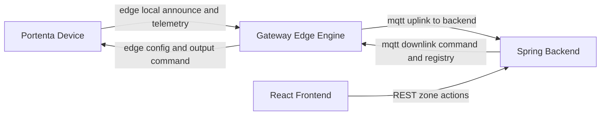

# GMS Backend Workspace

Cloud/backend workspace for the Greenhouse Management System.

## Folder Structure

- `backend/` - Spring Boot application (`gms-backend`)
- `infra/` - Docker Compose helpers for local backend runtime

## Domain Model (Current)

- `tenant` - user account/organization scope (future multi-tenant)
- `greenhouse` - site scope inside a tenant
- `gateway` - currently same operational scope as greenhouse
- `zone` - a Portenta device inside that greenhouse

Hierarchy:

`tenant -> greenhouse (gateway scope) -> zone (device)`

## What This Service Handles

- MQTT uplink ingest from gateway (`telemetry`, `registry`, `status`, `command_ack`)
- PostgreSQL + TimescaleDB persistence for live and historical state
- REST APIs used by frontend for zone management
- MQTT downlink publishing for zone sync and device commands

## End-to-End Flow



## Prerequisites

- Docker (recommended for non-backend contributors)
- Java 21+ and Maven (only if running backend natively)

## Run Options

### Option A: Dockerized backend (no local Java needed)

From repository root:

```bash
cd backend/infra
./scripts/up.sh
```

Follow logs while starting:

```bash
./scripts/up.sh -v
```

Stop:

```bash
./scripts/down.sh
```

Backend endpoint: `http://localhost:8081`

This stack starts two containers:

- `timescaledb` on `localhost:5432`
- `gms-backend-dev` on `localhost:8081`

The backend container connects to the gateway broker on host `1883`.

### Option B: Native backend development

From repository root:

```bash
cd backend/backend
./scripts/run_dev.sh
```

## Troubleshooting

- Health check: `curl http://localhost:8081/actuator/health`
- If frontend proxy reports `ECONNREFUSED` / `ECONNRESET`, backend is down or restarting.
- Check backend container logs: `docker logs -f gms-backend-dev`
- Native runs should use Java 21 (`java -version`).

## Config Profiles

- `application-dev.yml` - local dev profile, backend on port `8081`
- `application.yml` - default/prod-oriented settings

## Persistence (Current)

- `gms.telemetry_reading` - time-series history (Timescale hypertable, 90-day retention)
- `gms.latest_metric` - latest per-device sensor snapshot for `/v1/dashboard/live`
- `gms.zone_device` - discovered/assigned registry state
- `gms.command_ack` - latest command ack by `command_id`
- `gms.alert_event` - active + acknowledged + dismissed alerts

## REST API Purpose Map

### Zone management

- `GET /v1/zones/registry` - list discovered and assigned devices for a tenant+greenhouse
- `POST /v1/zones/assign` - assign one discovered device to a zone name/id
- `POST /v1/zones/unassign` - clear zone assignment for one device
- `POST /v1/zones/sync` - publish full registry snapshot to gateway
- `POST /v1/zones/command` - issue semantic command to one target zone/device
- `GET /v1/zones/command-ack` - fetch latest command ACK by `command_id`

### Dashboard / alerts

- `GET /v1/dashboard/live` - latest metric snapshot (including binary IO keys when available)
- `GET /v1/alerts` - active alerts list
- `POST /v1/alerts/{id}/acknowledge` - acknowledge alert
- `DELETE /v1/alerts/{id}` - dismiss alert

## MQTT Topic Purpose Map

### Uplink (gateway -> backend)

- `gms tenant greenhouse uplink telemetry` - normalized metrics for UI/analytics
- `gms tenant greenhouse uplink registry` - discovery and zone assignment lifecycle events
- `gms tenant greenhouse uplink status` - gateway heartbeat/online state
- `gms tenant greenhouse uplink command_ack` - command execution status

### Downlink (backend -> gateway)

- `gms tenant greenhouse downlink registry` - assign/unassign/full-sync instructions
- `gms tenant greenhouse downlink command` - semantic device commands

Detailed payload contract:

- `backend/backend/docs/zones-mqtt-v1.md`

## Example API Call

```bash
curl -X POST http://localhost:8081/v1/zones/assign \
  -H 'Content-Type: application/json' \
  -d '{
    "tenant_id":"tenant-demo",
    "greenhouse_id":"greenhouse-demo",
    "device_id":"portenta-747a9070570f",
    "zone_name":"banana"
  }'
```

Set device output channel from `/zones` control modal:

```bash
curl -X POST http://localhost:8081/v1/zones/command \
  -H 'Content-Type: application/json' \
  -d '{
    "tenant_id":"tenant-demo",
    "greenhouse_id":"greenhouse-demo",
    "device_id":"portenta-747a9070570f",
    "action":"SET_OUTPUT",
    "payload":{"channel":0,"state":1}
  }'
```

Poll command ACK status by command id:

```bash
curl "http://localhost:8081/v1/zones/command-ack?command_id=<command-id>"
```

## How Other Teams Should Use This Workspace

- Frontend team: run dockerized backend from `backend/infra` and consume `http://localhost:8081`
- Firmware/gateway team: keep topic contract aligned with `zones-mqtt-v1.md`
- Backend team: use native run (`backend/backend`) for coding/testing
