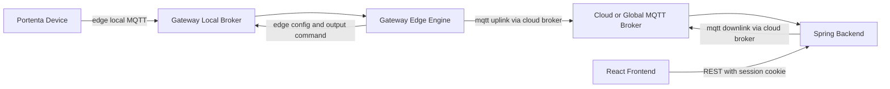

# GMS Backend Workspace

Cloud/backend workspace for the Greenhouse Management System.

## Folder Structure

- `backend/` - Spring Boot application (`gms-backend`)
- `infra/` - Docker Compose helpers for local backend runtime

## Current Auth and Tenant Model (Implemented)

- Session-based auth via Spring Security (`JSESSIONID` cookie).
- Public endpoints: `POST /v1/auth/signup`, `POST /v1/auth/login`.
- Protected endpoints: all other `/v1/**` routes require authentication.
- Tenant scope is derived from authenticated user (`AuthContext.requireTenantId(...)`), not passed by client payload.
- Signup creates a new tenant and first admin user in one transaction.

Domain hierarchy:

`tenant -> greenhouse (gateway scope) -> zone (device)`

## What This Service Handles

- MQTT uplink ingest from gateways (`telemetry`, `registry`, `status`, `command_ack`).
- MQTT downlink publish for registry sync and device commands.
- PostgreSQL + TimescaleDB persistence for live and historical state.
- Tenant-scoped REST APIs consumed by frontend.

## End-to-End Flow



## Prerequisites

- Docker (recommended for non-backend contributors)
- Java 21+ and Maven (only if running backend natively)

## Run Options

### Option A: Dockerized backend (recommended)

From repository root:

```bash
cd backend/infra
./scripts/up.sh
```

Follow logs while starting:

```bash
./scripts/up.sh -v
```

Stop:

```bash
./scripts/down.sh
```

Backend endpoint: `http://localhost:8081`

This stack starts:

- `gms-timescaledb` on `localhost:5432`
- `gms-backend-dev` on `localhost:8081`

The backend container connects to host MQTT on `host.docker.internal:1883`.

In the current local workflows that means:

- single-gateway mode: gateway workspace exposes the cloud/global broker on host `1883`
- cluster mode: cluster shared cloud broker also uses host `1883`

The backend does not talk to the Portenta-facing local broker directly.

### Option B: Native backend development

From repository root:

```bash
cd backend/backend
./scripts/run_dev.sh
```

## Config Profiles

- `application-dev.yml` - local dev profile, backend on `8081`, subscribes `gms/+/+/uplink/#`
- `application.yml` - default/prod-oriented settings (TLS-capable MQTT config)

## REST API Purpose Map

### Auth

- `POST /v1/auth/signup` - create tenant + tenant admin
- `POST /v1/auth/login` - create authenticated session
- `POST /v1/auth/logout` - clear session
- `GET /v1/auth/me` - current user/tenant profile

### Greenhouses

- `GET /v1/g` - list greenhouses for current tenant
- `POST /v1/g` - create greenhouse in current tenant
- `GET /v1/g/{greenhouse_id}` - get greenhouse
- `PATCH /v1/g/{greenhouse_id}` - update greenhouse name/gateway mapping
- `DELETE /v1/g/{greenhouse_id}` - delete greenhouse and scoped data
- `GET /v1/g/{greenhouse_id}/gateway-config` - helper env block for gateway setup

### Zones (scoped by greenhouse)

- `GET /v1/g/{greenhouse_id}/zones/registry`
- `POST /v1/g/{greenhouse_id}/zones/assign`
- `POST /v1/g/{greenhouse_id}/zones/unassign`
- `POST /v1/g/{greenhouse_id}/zones/sync`
- `POST /v1/g/{greenhouse_id}/zones/command`
- `GET /v1/g/{greenhouse_id}/zones/command-ack?command_id=...`
- `GET /v1/g/{greenhouse_id}/zones/{zone_id}/thresholds`
- `PUT /v1/g/{greenhouse_id}/zones/{zone_id}/thresholds`
- `GET /v1/g/{greenhouse_id}/zones/{zone_id}/thresholds/status`

### Dashboard / Alerts

- `GET /v1/dashboard/live?greenhouse_id=...&zone_id=...`
- `GET /v1/alerts`
- `POST /v1/alerts/{id}/acknowledge`
- `DELETE /v1/alerts/{id}`

## MQTT Topic Purpose Map

### Uplink (gateway -> backend)

- `gms/{tenant}/{greenhouse}/uplink/telemetry`
- `gms/{tenant}/{greenhouse}/uplink/registry`
- `gms/{tenant}/{greenhouse}/uplink/status`
- `gms/{tenant}/{greenhouse}/uplink/command_ack`
- `gms/{tenant}/{greenhouse}/uplink/alert`

### Downlink (backend -> gateway)

- `gms/{tenant}/{greenhouse}/downlink/registry`
- `gms/{tenant}/{greenhouse}/downlink/command`
- `gms/{tenant}/{greenhouse}/downlink/threshold`

Detailed payload contract:

- `backend/backend/docs/zones-mqtt-v1.md`

## Session Example (curl)

```bash
# 1) signup
curl -sS -X POST http://localhost:8081/v1/auth/signup \
  -H 'Content-Type: application/json' \
  -d '{"username":"demo-admin","password":"pass1234","tenant_name":"Demo Org","tenant_id":"demo-org"}'

# 2) login and store cookie
curl -sS -c /tmp/gms.cookie -X POST http://localhost:8081/v1/auth/login \
  -H 'Content-Type: application/json' \
  -d '{"username":"demo-admin","password":"pass1234"}'

# 3) list greenhouses in current tenant
curl -sS -b /tmp/gms.cookie http://localhost:8081/v1/g

# 4) assign a discovered device
curl -sS -X POST http://localhost:8081/v1/g/greenhouse-demo/zones/assign \
  -H 'Content-Type: application/json' \
  -b /tmp/gms.cookie \
  -d '{"device_id":"portenta-747a9070570f","zone_name":"banana"}'
```

## Persistence (Current)

- `gms.tenant`, `gms.app_user`, `gms.tenant_membership`, `gms.greenhouse`
- `gms.zone_device` - discovered/assigned registry state
- `gms.command_ack` - latest command ack by `command_id`
- `gms.zone_threshold` - zone-scoped threshold config and version
- `gms.threshold_apply_status` - gateway apply status by threshold version
- `gms.telemetry_reading` - time-series history (Timescale hypertable)
- `gms.latest_metric` - latest per-device sensor snapshot
- `gms.alert_event` - active/acknowledged/dismissed alerts

## Troubleshooting

- Health check: `curl http://localhost:8081/actuator/health`
- `401`/`403` on API calls usually means missing/expired session cookie.
- If frontend proxy reports `ECONNREFUSED` / `ECONNRESET`, backend is down or restarting.
- Backend logs: `docker logs -f gms-backend-dev`
- Native runs should use Java 21 (`java -version`).
- If the gateway stack was recently changed from cluster to single-gateway mode, clear stale gateway containers before retesting so the backend stays attached to the intended broker on `1883`.
